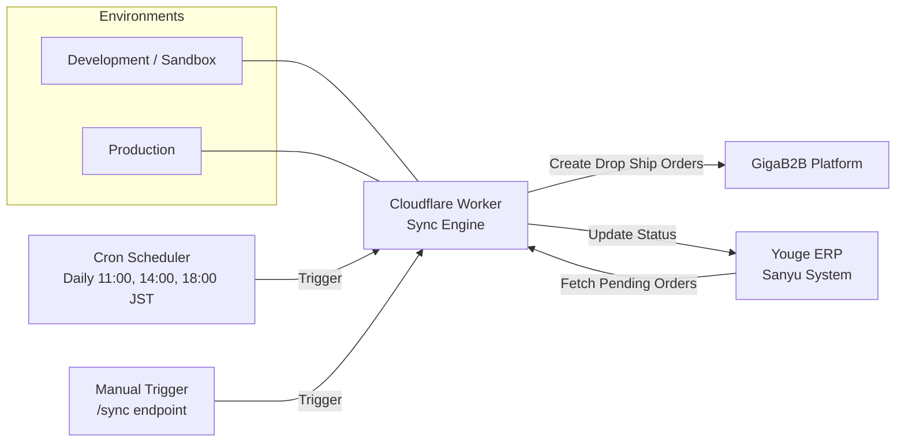

# Business Requirements Document (BRD)
## GIGA Order Automation - Shipment Sync Application

**Version:** 1.0  
**Last Updated:** 2026-02-11  
**Status:** Active Development

---

## 1. Executive Summary

### 1.1 Purpose
This document outlines the business requirements for an automated order synchronization system that integrates Sanyu's internal ERP system (Youge) with GigaB2B's drop shipping platform. The application automatically creates shipment orders in GigaB2B based on pending orders in Youge, eliminating manual data entry and reducing order processing time.

### 1.2 Business Objectives
- **Automate Order Processing**: Eliminate manual order entry between Youge and GigaB2B
- **Reduce Processing Time**: Decrease order fulfillment time from hours to minutes
- **Improve Accuracy**: Eliminate human errors in order data transfer
- **Enable Scalability**: Support growing order volumes without additional manual effort
- **Real-time Status Tracking**: Maintain order status synchronization between systems

### 1.3 Success Criteria
- ✅ Orders are automatically created in GigaB2B within 5 minutes of appearing in Youge
- ✅ Order accuracy rate of 99.9% or higher
- ✅ Zero manual intervention required for standard orders
- ✅ Complete audit trail of all order processing activities
- ✅ Automatic error handling and notification for failed orders

---

## 2. System Overview

### 2.1 Application Architecture



### 2.2 System Components

| Component | Technology | Purpose |
|-----------|-----------|---------|
| **Sync Engine** | Cloudflare Worker | Core orchestration and business logic |
| **Youge Client** | JavaScript API Client | Interface with Sanyu's Youge ERP system |
| **GIGA Client** | JavaScript API Client | Interface with GigaB2B OpenAPI 2.0 |
| **Scheduler** | Cloudflare Cron Trigger | Automated daily execution |
| **Manual Trigger** | HTTP Endpoint | On-demand synchronization |

### 2.3 Deployment Platform
- **Platform**: Cloudflare Workers (Serverless)
- **Environments**:
    - **Development (`dev`)**: Targets GigaB2B Sandbox (`https://openapi-sandbox.gigab2b.com`)
    - **Production (`production`)**: Targets GigaB2B Production (`https://openapi.gigab2b.com`)
- **Region**: Global edge network
- **Scalability**: Auto-scaling based on request volume
- **Cost Model**: Pay-per-execution

---

## 3. Functional Requirements

### 3.1 Order Synchronization Workflow

#### 3.1.1 Order Detection
- **FR-001**: System SHALL fetch pending orders from Youge every execution
- **FR-002**: System SHALL identify orders in "Pending" state, defined as:
    - Status Field (`F00000AL3`) equals "Pending"

#### 3.1.2 Order Grouping
- **FR-004**: System SHALL group multiple line items by Order ID
- **FR-005**: System SHALL consolidate all line items for the same order into a single GigaB2B order
- **FR-006**: System SHALL preserve all line item details (SKU, quantity) during grouping

#### 3.1.3 Order Creation
- **FR-007**: System SHALL create drop shipping orders in GigaB2B using OpenAPI 2.0
- **FR-008**: System SHALL include all required fields:
  - Order Number (unique identifier)
  - Order Date
  - Shipping Information (name, phone, address, city, state, country, zip code)
  - Sales Channel
  - Order Lines (SKU, quantity, itemPrice, orderDetailNo, currency)
- **FR-009**: System SHALL use HMAC-SHA256 signature authentication for API security

#### 3.1.4 Status Management
- **FR-010**: System SHALL update Youge order status to "Processed" upon successful creation
- **FR-011**: System SHALL update Youge order status to "Error" upon failure
- **FR-012**: System SHALL record error messages in Youge for failed orders
#### 3.1.5 Shipment Information Synchronization (GigaB2B -> Youge)
- **FR-013.1**: System SHALL fetch tracking and shipment information from GigaB2B every execution at 18:00 JST
- **FR-013.2**: System SHALL update Youge with the following fields:
    - Carrier Name (`F00000AZW`)
    - Tracking Number (`F00000AZX`)
- **FR-013.3**: System SHALL update Youge Status (`F00000AL3`) to "Completed" upon successful shipment info sync. Note: This is a single-choice field.

### 3.2 Scheduling & Triggers

#### 3.2.1 Automated Execution
- **FR-014**: System SHALL execute automatically three times daily:
    - **11:00 AM JST** (02:00 UTC): Order Creation Sync
    - **02:00 PM JST** (05:00 UTC): Order Creation Sync
    - **06:00 PM JST** (09:00 UTC): Shipment Information Sync

#### 3.2.2 Manual Execution
- **FR-016**: System SHALL support manual triggering via HTTP endpoint `/sync`
- **FR-017**: System SHALL return execution results in JSON format
- **FR-018**: System SHALL provide summary statistics (success count, failure count, errors)

### 3.3 Error Handling

#### 3.3.1 API Failures
- **FR-019**: System SHALL retry failed API calls up to 3 times with exponential backoff
- **FR-020**: System SHALL log all API errors with full context
- **FR-021**: System SHALL continue processing remaining orders after individual failures

#### 3.3.3 Authentication Error Handling
- **FR-031**: System SHALL log full API response for authentication failures (401 errors)
- **FR-032**: System SHALL alert administrators on repeated authentication failures
- **FR-033**: System SHALL provide actionable error messages with troubleshooting steps
- **FR-034**: System SHALL validate API endpoint and credentials on startup
- **FR-035**: System SHALL include request headers (excluding secrets) in error logs for debugging

#### 3.3.2 Data Validation
- **FR-022**: System SHALL validate required fields before creating orders
- **FR-023**: System SHALL skip orders with missing critical data (Order ID, SKU, shipping address)
- **FR-024**: System SHALL log validation errors for manual review

### 3.4 Logging & Monitoring

#### 3.4.1 Execution Logs
- **FR-025**: System SHALL log all execution events (start, end, order counts)
- **FR-026**: System SHALL log individual order processing results
- **FR-027**: System SHALL maintain logs for 30 days minimum

#### 3.4.2 Performance Metrics
- **FR-028**: System SHALL track execution duration
- **FR-029**: System SHALL track success/failure rates
- **FR-030**: System SHALL provide real-time log streaming via `wrangler tail`

---

## 4. Data Requirements

### 4.1 Youge Data Schema

#### 4.1.1 Shipment Order Table
| Field Name | Field Code | Data Type | Required | Description |
|------------|-----------|-----------|----------|-------------|
| Status | F00000AL3 | String | No | Order processing status |
| Order ID | F00000ALE | String | Yes | Unique order identifier |
| Ship To Name | F00000AL8 | String | Yes | Recipient name |
| Ship To Address | F00000ALC | String | Yes | Shipping street address |
| Ship To City | F00000ALD | String | Yes | Shipping city |
| Ship To State | F00000ALF | String | Yes | Shipping state/province |
| Ship To Postal Code | F00000ALB | String | Yes | Shipping ZIP/postal code |
| Ship To Country | F00000ALG | String | Yes | Shipping country code |
| Ship To Phone | F00000ALA | String | Yes | Recipient phone number |
| Ship To Email | F00000AL9 | String | No | Recipient email address |
| Ship From | F00000AKT | String | Yes | Default: "Mercari Lifestyle" |
| B2B Item Code | F00000AL5 | String | Yes | Product SKU |
| Ship To Qty | F00000AL6 | Integer | Yes | Order quantity |
| Sales Channel | F00000AKS | String | No | Sales channel identifier |
| Order Date | F00000ALJ | DateTime | No | Order creation date |
| Order Comments | F00000ALP | String | No | Processing notes/errors |

### 4.2 GigaB2B Order Payload

#### 4.2.1 Drop Ship Order Structure
```json
{
  "orderNo": "string",
  "orderDate": "YYYY-MM-DD HH:mm:ss",
  "shipName": "string",
  "shipPhone": "string",
  "shipAddress1": "string",
  "shipCity": "string",
  "shipState": "string",
  "shipCountry": "string",
  "shipZipCode": "string",
  "salesChannel": "string",
  "shipFrom": "string",
  "hasOtherLabel": "false",
  "orderLines": [
    {
      "sku": "string",
      "qty": integer,
      "orderDetailNo": integer,
      "itemPrice": number,
      "currency": "string"
    }
  ]
}
```

### 4.3 Data Mapping

| Youge Field | GigaB2B Field | Transformation |
|-------------|---------------|----------------|
| F00000ALE | orderNo | Direct mapping |
| F00000ALJ | orderDate | Format: YYYY-MM-DD HH:mm:ss |
| F00000AL8 | shipName | Direct mapping |
| F00000ALA | shipPhone | Direct mapping |
| F00000ALC | shipAddress1 | Direct mapping |
| F00000ALD | shipCity | Direct mapping |
| F00000ALF | shipState | Direct mapping |
| F00000ALG | shipCountry | Default: "JP" if empty |
| F00000ALB | shipZipCode | Direct mapping |
| F00000AKS | salesChannel | Direct mapping |
| F00000AKT | shipFrom | Direct mapping (Default: "Mercari Lifestyle") |
| F00000AL5 | orderLines[].sku | Grouped by Order ID |
| F00000AL6 | orderLines[].qty | Grouped by Order ID |
| F00000AL4 | orderLines[].orderDetailNo | Line item sequence number |
| F00000ALY | orderLines[].itemPrice | Buyer Sku Commercial Value |
| - | orderLines[].currency | Default: "JPY" for Japan release |
| **GigaB2B -> Youge** | | |
| shipTrackInfo[].carrierName | F00000AZW | From GigaB2B track-no info (Joined by " / " if multiple) |
| shipTrackInfo[].trackingNum | F00000AZX | "Carrier: TrackingNumber" (Joined by "; " if multiple) |
| "Completed" | F00000AL3 | Final status after shipment update |

---

## 5. Integration Requirements

### 5.1 Youge ERP Integration

#### 5.1.1 API Configuration
- **Base URL**: https://sanyu.cloud/openapi
- **Authentication**: Bearer token (App Token)
- **Headers Required**:
  - `Authorization: Bearer {token}` (Note: Single space between Bearer and token is mandatory)
  - `X-H3-AppCode: {appCode}`
  - `X-H3-EngineCode: {engineCode}` (Optional depending on environment)
  - `Content-Type: application/json`

#### 5.1.2 API Endpoints
| Endpoint | Method | Purpose |
|----------|--------|---------|
| `/records/{appCode}/{schemaCode}` | POST | Fetch pending orders |
| `/record/{appCode}/{schemaCode}/{objectId}` | PATCH | Update order status |

#### 5.1.3 Youge Request Body (Fetch Records)
To retrieve records from the Youge API, the following JSON structure is required:
```json
{
  "offset": 0,
  "limit": 100,
  "filters": [],
  "returnColumns": [],
  "sorts": []
}
```
> [!NOTE]
> If direct API filtering fails, the worker will fetch the most recent records and apply status filtering (FR-002) in the application logic.

### 5.2 GigaB2B Integration

#### 5.2.1 API Configuration
- **Base URL (Production)**: https://openapi.gigab2b.com
- **Base URL (Sandbox)**: https://openapi-sandbox.gigab2b.com
---

## 五、域名

测试环境域名：
- https://openapi-sandbox.gigab2b.com

生产环境域名：
- https://openapi.gigab2b.com

> 注：以上为 OpenAPI 2.0 版本接口域名（非 1.0）。OpenAPI 1.0 文档请在帮助中心查看《GIGA Open API 1.0文档》，请勿混淆。

> [!IMPORTANT]
> **Verified Production Configuration:**
> - The production endpoint `https://openapi.gigab2b.com` is confirmed to work for Client ID `83142311_JPN_release`.
> - **Mandatory Fields for JP**: Integration testing for the Japanese market confirmed that `itemPrice`, `orderDetailNo`, and `currency` are required for successful order creation.

### Testing Notes (Verified 2026-02-11)

Integration testing for the Japanese market confirmed:
- ✅ **Signature generation** algorithm is fully compatible with OpenAPI 2.0.
- ✅ **Multi-SKU Consolidation** works by grouping `orderLines`.
- ✅ **Mandatory Fields for JP**: `itemPrice`, `orderDetailNo`, and `currency` are required for successful order creation.
- ✅ **Endpoint Connectivity**: Production domain is reachable and authenticates correctly.

---
- **Authentication**: HMAC-SHA256 signature
- **API Version**: OpenAPI 2.0

#### 5.2.2 Signature Algorithm
1. Construct message: `clientId & apiPath & timestamp & nonce`
2. Construct key: `clientId & clientSecret & nonce`
3. HMAC-SHA256 encrypt and convert to hex
4. Base64 encode the result

#### 5.2.3 Required Headers
- `Content-Type: application/json`
- `client-id`: Client ID from GIGA platform
- `timestamp`: Millisecond timestamp (must be within 20 minutes)
- `nonce`: Random 10-digit string
- `sign`: HMAC-SHA256 signature (base64 encoded)

#### 5.2.4 API Endpoints
| Endpoint | Method | Purpose | Required Fields (JP) |
|----------|--------|---------|-----------------------|
| `/b2b-overseas-api/v1/buyer/order/dropShip-sync/v1` | POST | Create drop ship order | orderNo, orderDate, shipName, shipPhone, shipAddress1, shipCity, shipState, shipCountry, shipZipCode, orderLines[sku, qty, orderDetailNo, itemPrice, currency] |
| `/b2b-overseas-api/v1/buyer/order/track-no/v1` | POST | Query tracking number | orderNo (array) |

---

## 6. Non-Functional Requirements

### 6.1 Performance
- **NFR-001**: Order processing SHALL complete within 5 minutes for batches up to 100 orders
- **NFR-002**: API response time SHALL be under 3 seconds per order
- **NFR-003**: System SHALL support concurrent processing of multiple orders

### 6.2 Reliability
- **NFR-004**: System uptime SHALL be 99.9% or higher
- **NFR-005**: System SHALL recover automatically from transient failures
- **NFR-006**: System SHALL maintain data consistency between Youge and GigaB2B

### 6.3 Security
- **NFR-007**: All API credentials SHALL be stored as encrypted secrets
- **NFR-008**: API signatures SHALL use cryptographically secure algorithms
- **NFR-009**: System SHALL validate timestamp freshness (within 20 minutes)
- **NFR-010**: System SHALL use HTTPS for all API communications

### 6.4 Maintainability
- **NFR-011**: Code SHALL follow industry best practices and standards
- **NFR-012**: System SHALL provide comprehensive logging for troubleshooting
- **NFR-013**: Configuration SHALL be externalized (environment variables)
- **NFR-014**: System SHALL support easy deployment via Wrangler CLI

### 6.5 Scalability
- **NFR-015**: System SHALL handle order volume growth without code changes
- **NFR-016**: System SHALL leverage Cloudflare's global edge network
- **NFR-017**: System SHALL support horizontal scaling automatically

---

## 7. Configuration & Deployment

### 7.1 Environment Variables

#### 7.1.1 GigaB2B Configuration
| Variable | Type | Description | Example |
|----------|------|-------------|---------|
| GIGA_CLIENT_ID | String | GigaB2B API Client ID | 83142311_JPN_release |
| GIGA_CLIENT_SECRET | Secret | GigaB2B API Client Secret | ••• |
| GIGA_API_BASE_URL | String | GigaB2B API Base URL | https://api.gigacloudlogistics.com |

#### 7.1.2 Youge Configuration
| Variable | Type | Description | Example |
|----------|------|-------------|---------|
| YOUGE_APP_TOKEN | Secret | Youge API Bearer Token | ••• |
| YOUGE_APP_CODE | String | Youge Application Code | apbhhitm6xica7akck |
| YOUGE_SCHEMA_CODE | String | Youge Schema Code | smhdzccpti8vrlyzj0 |
| YOUGE_ENGINE_CODE | String | Youge Engine Code | c00000000000s4-0 |
| YOUGE_BASE_URL | String | Youge API Base URL | https://sanyu.cloud |

### 7.2 Deployment Configuration

#### 7.2.1 Cloudflare Worker Settings
- **Production Worker Name**: `giga-shipment-sync-worker`
- **Development Worker Name**: `giga-shipment-sync-worker-dev`
- **Compatibility Date**: 2026-02-11
- **Main Entry Point**: `src/worker.js`
- **Cron Schedule (Production)**:
    - `0 2,5,9 * * *` (Consolidated trigger for 11:00 AM, 02:00 PM, and 06:00 PM JST)

#### 7.2.2 Deployment Process
1. **Initial Setup**: Configure `wrangler.toml` environments.
2. **Set Secrets** (required for each environment):
   - **Development**:
     - `wrangler secret put GIGA_CLIENT_SECRET --env dev`
     - `wrangler secret put YOUGE_APP_TOKEN --env dev`
   - **Production**:
     - `wrangler secret put GIGA_CLIENT_SECRET --env production`
     - `wrangler secret put YOUGE_APP_TOKEN --env production`
3. **Deploy**:
   - Development: `npm run deploy:dev`
   - Production: `npm run deploy:prod`
4. **Verify**: Test manual trigger via `/sync` endpoint on the deployed worker URL.

---

## 8. User Roles & Access

### 8.1 System Roles

| Role | Access Level | Responsibilities |
|------|-------------|------------------|
| **System Administrator** | Full access | Deploy, configure, monitor system |
| **Operations Team** | Read-only logs | Monitor order processing, investigate errors |
| **Development Team** | Full access | Develop, test, deploy updates |

### 8.2 Access Control
- Cloudflare Workers dashboard access for deployment
- Wrangler CLI access for developers
- Log streaming access for operations team
- Secret management access for administrators

---

## 9. Testing Requirements

### 9.1 Unit Testing
- Test signature generation algorithm
- Test data mapping and transformation
- Test order grouping logic
- Test error handling scenarios

### 9.2 Integration Testing
- Test Youge API connectivity
- Test GigaB2B API connectivity
- Test end-to-end order flow
- Test status update mechanism

### 9.3 User Acceptance Testing
- Create test orders in Youge
- Verify orders appear in GigaB2B
- Verify status updates in Youge
- Verify error handling for invalid data

### 9.4 API Validation Testing

> [!IMPORTANT]
> **Critical Pre-Production Steps**

Before production deployment, the following validations MUST be completed:

1. **Verify API Credentials with GIGA Support**
   - Confirm Client ID and Secret are production-ready
   - Verify API key has drop shipping order creation permissions
   - Confirm correct base URL for specific Client ID region

2. **Test Signature Generation**
   - Validate against known-good examples from GIGA
   - Compare with working implementations if available
   - Verify timestamp handling and nonce generation

3. **Validate Endpoint URL**
   - Test with both `https://openapi.gigab2b.com` and `https://api.gigacloudlogistics.com`
   - Confirm which endpoint works for specific Client ID
   - Document endpoint selection criteria

4. **Sandbox Environment Testing**
   - Request sandbox credentials from GIGA
   - Test full order flow in sandbox before production
   - Validate error handling with intentionally invalid data

5. **Permission Verification**
   - Confirm all required API permissions are granted
   - Test with minimal viable order payload
   - Verify response format matches expectations

**Test Results Reference:** See [Integration Test Report](file:///C:/Users/Lenovo/.gemini/antigravity/brain/fd6c9019-420e-43a3-84f8-cf839ed7e73b/test_report.md) for detailed findings.

---

## 10. Constraints & Assumptions

### 10.1 Technical Constraints
- GigaB2B API rate limits (per endpoint documentation)
- Cloudflare Workers execution time limit (30 seconds per request)
- Youge API pagination limit (100 records per request)
- API timestamp validity window (20 minutes)
- **API endpoint selection depends on Client ID region** (requires GIGA support verification)

### 10.2 Business Constraints
- Orders must be processed during business hours
- Manual intervention required for complex order scenarios
- GigaB2B only supports On-Site Seller accounts
- **Production API credentials require approval from GIGA**
- **Sandbox testing environment strongly recommended before production**

### 10.3 Assumptions
- Youge system maintains accurate and complete order data
- GigaB2B API availability is 99.9% or higher
- Network connectivity is reliable
- Order volumes remain under 1000 orders per day
- All products have valid SKUs in GigaB2B system
- **Correct API endpoint will be confirmed by GIGA support before production deployment**

---

## 11. Risks & Mitigation

| Risk | Impact | Probability | Mitigation Strategy |
|------|--------|-------------|---------------------|
| API authentication failure | High | Low | Implement retry logic, monitor credentials expiration |
| Network connectivity issues | Medium | Medium | Implement exponential backoff, queue failed orders |
| Invalid order data | Medium | Medium | Implement validation, log errors for manual review |
| GigaB2B API changes | High | Low | Monitor API version updates, maintain backward compatibility |
| Order volume spike | Medium | Low | Implement batch processing, monitor performance metrics |
| Duplicate order creation | High | Low | Implement idempotency checks using Order ID |

---

## 12. Future Enhancements (Backlog)

### 12.1 Phase 2 Features
- **Real-time Webhooks**: Replace polling with event-driven architecture
- **Order Status Tracking**: Sync fulfillment status from GigaB2B back to Youge
- **Inventory Validation**: Check GigaB2B inventory before order creation
- **Multi-warehouse Support**: Route orders to optimal fulfillment centers
- **Advanced Error Recovery**: Automatic retry queue for failed orders

### 12.2 Phase 3 Features
- **Analytics Dashboard**: Order processing metrics and trends
- **Email Notifications**: Alert stakeholders of processing issues
- **Bulk Order Import**: Support CSV/Excel file uploads
- **Custom Business Rules**: Configurable order routing and validation
- **Multi-tenant Support**: Support multiple Youge instances

---

## 13. Glossary

| Term | Definition |
|------|------------|
| **Drop Shipping** | Fulfillment method where seller doesn't keep products in stock but transfers orders to third party |
| **ERP** | Enterprise Resource Planning - integrated management of business processes |
| **Youge** | Cloud-based ERP platform used by Sanyu for order management |
| **GigaB2B** | B2B e-commerce and logistics platform for wholesale and drop shipping |
| **Cloudflare Worker** | Serverless execution environment running on Cloudflare's edge network |
| **HMAC-SHA256** | Hash-based Message Authentication Code using SHA-256 cryptographic hash |
| **Cron Trigger** | Scheduled task execution at specified intervals |
| **SKU** | Stock Keeping Unit - unique identifier for products |
| **OpenAPI 2.0** | GigaB2B's second version of their public API |

---

## 14. Approval & Sign-off

| Role | Name | Date | Signature |
|------|------|------|-----------|
| Business Owner | | | |
| Technical Lead | | | |
| Project Manager | | | |

---

## 15. Document History

| Version | Date | Author | Changes |
|---------|------|--------|---------|
| 1.0 | 2026-02-11 | AI Assistant | Initial BRD creation |

---

**Document Status**: Draft - Pending Review  
**Next Review Date**: TBD  
**Contact**: [Project Team Contact Information]
